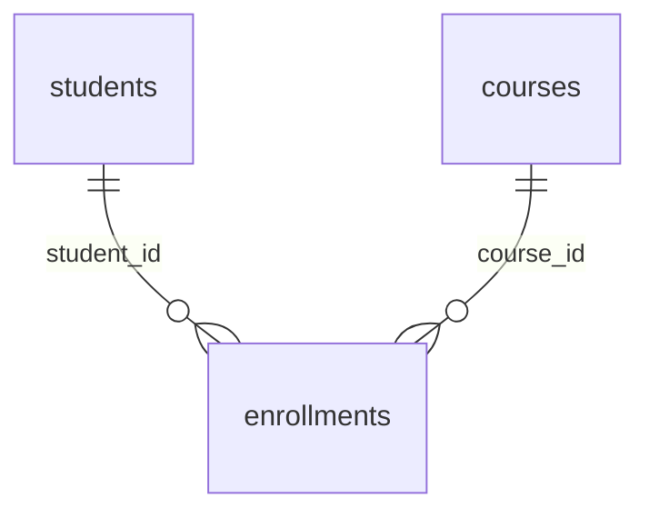

# Akademik KRS — Single Page CRUD

Aplikasi pengelolaan KRS (Kartu Rencana Studi) mahasiswa: satu halaman untuk create/read/update/delete data `enrollments`, dengan pagination, sorting, filtering, dan pencarian yang seluruhnya dieksekusi server-side agar tetap responsif pada dataset 5 juta+ baris.

- **Akses online:** https://tes.miftahulhuda.site
- **Repository:** https://github.com/MiftahulH23/tes-pcr

Dibangun untuk Tes Teknis Web Developer (Full Stack) Q3 2026.

## Daftar Isi

- [Tech Stack](#tech-stack)
- [Struktur Fitur](#struktur-fitur)
- [Aturan Validasi & Asumsi](#aturan-validasi--asumsi)
- [Setup Lokal](#setup-lokal)
- [Variabel Environment](#variabel-environment)
- [Skema Database](#skema-database)
- [Seeding 5 Juta Baris](#seeding-5-juta-baris)
- [Menjalankan Test](#menjalankan-test)
- [API / Routes](#api--routes)
- [Keputusan Desain](#keputusan-desain)
- [Strategi Performa](#strategi-performa)
- [Keamanan & Observability](#keamanan--observability)
- [Deployment](#deployment)

## Tech Stack

| Layer | Pilihan |
|---|---|
| Backend | Laravel 13 (PHP 8.4) |
| Frontend | React 19 + TypeScript + Inertia.js (satu aplikasi, tanpa REST API terpisah untuk navigasi halaman) |
| UI Components | shadcn/ui (Radix UI primitives) + Tailwind CSS v4, bawaan dari `laravel/react-starter-kit`; notifikasi toast dengan `sonner` |
| Database | PostgreSQL, termasuk fitur `pg_trgm` untuk pencarian cepat |
| Build tool | Vite |

Versi yang dipakai: di CI PHP 8.4, Node.js 22, PostgreSQL 18; di production PHP 8.4.25, Node.js 20.20, PostgreSQL 18, Nginx 1.24 (Ubuntu 24.04).

## Struktur Fitur

- **Skema**: `students`, `courses`, `enrollments` (FK ke keduanya), lihat [Skema Database](#skema-database) dan `database/migrations/`.
- **Create**: `app/Actions/Enrollments/CreateEnrollment.php` — membuat student/course baru atau memakai yang sudah terdaftar (berdasarkan `nim`/`code`, lihat [mode Create](#keputusan-desain)), lalu insert enrollment, seluruhnya dalam **1 DB transaction** (`DB::transaction`). Jika salah satu insert gagal, semua rollback.
- **Read (tabel data)**: `app/Http/Controllers/EnrollmentController@data` + `app/Support/EnrollmentFilters.php` — query builder terpusat untuk pagination, sort, quick filter, advanced filter (AND/OR), dan live search.
- **Detail**: `EnrollmentController@show` + `app/Http/Resources/EnrollmentDetailResource.php` — ikon mata di kolom Aksi membuka modal berisi data lengkap satu KRS: mahasiswa (NIM, nama, email), mata kuliah (kode, nama, SKS), dan KRS (ID, tahun ajaran, semester, status, waktu dibuat dan diperbarui dalam WIB). Data diambil dari server saat modal dibuka, dengan tampilan loading, pesan error + tombol "Coba lagi", dan pesan khusus bila KRS sudah dihapus.
- **Update**: `app/Actions/Enrollments/UpdateEnrollment.php` — bisa sekaligus ubah nama/email student dan nama/credits course terkait.
- **Delete**: soft delete (`Enrollment` pakai trait `SoftDeletes`) — lihat bagian [Keputusan Desain](#keputusan-desain).
- **Export CSV**: `app/Actions/Enrollments/ExportEnrollmentsCsv.php` — streaming response, tidak memuat seluruh dataset ke memori (lihat [Strategi Performa](#strategi-performa)).
- **Seeder 5 juta baris**: `app/Console/Commands/SeedEnrollments.php`.

Controller sengaja tipis: hanya menghubungkan request ke class yang tepat. Validasi ada di FormRequest, logika bisnis di Action, query di `EnrollmentFilters`, bentuk JSON di Resource. Peta folder:

```
app/
  Actions/Enrollments/     logika bisnis (Create, Update, ExportEnrollmentsCsv)
  Http/Controllers/        EnrollmentController — hanya penghubung
  Http/Requests/           validasi (StoreEnrollmentRequest, UpdateEnrollmentRequest)
  Http/Resources/          bentuk JSON (EnrollmentResource, EnrollmentDetailResource)
  Http/Middleware/         LogRequests (request logging)
  Support/                 EnrollmentFilters (pagination, sort, filter, search)
  Models/                  Student, Course, Enrollment
  Console/Commands/        SeedEnrollments
database/migrations/       skema + index (termasuk trigram)
lang/id/validation.php     pesan validasi Bahasa Indonesia
resources/js/
  pages/enrollments/       halaman utama (Inertia)
  components/enrollments/  tabel, toolbar, dialog form/detail, filter lanjutan, pagination
  components/ui/           komponen dasar shadcn/ui
  hooks/                   use-enrollment-table (state + fetch), debounce, tema
  lib/                     api.ts (fetch + CSRF), enrollment-validation.ts (validasi frontend)
tests/Feature/             test untuk Actions dan Support
docs/                      Postman collection
```

Aturan kerja yang lebih rinci untuk kontributor (termasuk agent AI) ada di [`AGENTS.md`](AGENTS.md).

## Aturan Validasi & Asumsi

- Autentikasi (login/register) tersedia dari starter kit Laravel namun **tidak digunakan** untuk fitur KRS — halaman `/enrollments` dapat diakses tanpa login.
- Validasi format:
  - `students`: `nim` wajib, unik, 8-12 digit angka tanpa spasi; `name` 3-100 karakter; `email` valid dan unik.
  - `courses`: `code` wajib, unik, format `[A-Z]{2,4}[0-9]{3}` (contoh `IF101`); `name` 3-120 karakter; `credits` integer 1-6.
  - `enrollments`: `academic_year` format `YYYY/YYYY` dengan tahun kedua = tahun pertama + 1; `semester` `GANJIL`/`GENAP`; `status` `DRAFT`/`SUBMITTED`/`APPROVED`/`REJECTED`; kombinasi `(student_id, course_id, academic_year, semester)` tidak boleh duplikat.
- **Keunikan `nim` dan `code` ditegakkan saat mendaftarkan data baru**: membuat mahasiswa baru dengan NIM yang sudah ada, atau mata kuliah baru dengan kode yang sudah ada, ditolak `422`. Untuk menambah KRS bagi mahasiswa/mata kuliah yang sudah terdaftar, form menyediakan checkbox **"Mahasiswa sudah terdaftar"** dan **"Mata kuliah sudah ada"** (API: `student.existing` / `course.existing`) — lihat [Keputusan Desain](#keputusan-desain). Satu mahasiswa boleh punya banyak KRS; yang ditolak hanya KRS yang persis sama.
- Validasi berjalan di **frontend** (`resources/js/lib/enrollment-validation.ts`, memblokir submit sebelum request dikirim) dan di **backend** (FormRequest, otoritatif — payload yang tidak valid ditolak dengan HTTP 422 walau frontend dilewati).
- Pesan validasi dan error UI dalam Bahasa Indonesia (`lang/id/validation.php`, `APP_LOCALE=id`).

## Setup Lokal

### Prasyarat

- PHP 8.4 dengan ekstensi `pdo_pgsql` dan `pgsql` aktif
- Composer
- Node.js 20+ dan npm (production memakai 20.x, CI memakai 22)
- PostgreSQL dengan ekstensi `pg_trgm` (di sebagian distribusi ada di paket `postgresql-contrib`). Migration menjalankan `CREATE EXTENSION IF NOT EXISTS pg_trgm`; di PostgreSQL 13+ ekstensi ini berstatus *trusted* sehingga cukup dijalankan sebagai owner database, di versi lebih lama perlu superuser.

### 1. Clone & install dependency

```bash
git clone https://github.com/MiftahulH23/tes-pcr
cd tes-pcr
composer install
npm install
```

### 2. Konfigurasi environment

```bash
cp .env.example .env
php artisan key:generate
```

Edit `.env`, sesuaikan kredensial database:

```
DB_CONNECTION=pgsql
DB_HOST=127.0.0.1
DB_PORT=5432
DB_DATABASE=tes_pcr
DB_USERNAME=tes_pcr
DB_PASSWORD=isi_password_kamu
```

Daftar lengkap variabel dan nilai yang disarankan untuk produksi ada di [Variabel Environment](#variabel-environment).

### 3. Buat database & user PostgreSQL

```sql
CREATE ROLE tes_pcr LOGIN PASSWORD 'isi_password_kamu';
CREATE DATABASE tes_pcr OWNER tes_pcr;
```

### 4. Jalankan migration

```bash
php artisan migrate
```

Migration ini juga mengaktifkan ekstensi `pg_trgm` dan membuat index GIN trigram untuk pencarian cepat (lihat `database/migrations/*_add_trigram_search_indexes.php`).

### 5. Build asset frontend

```bash
npm run build
```

### 6. Jalankan aplikasi

Untuk sekadar menjalankan/testing (tidak sedang edit kode frontend):

```bash
php artisan serve
```

Untuk mode development (hot-reload frontend, queue listener, log viewer sekaligus):

```bash
composer run dev
```

> **Catatan Windows**: panel "logs" pada `composer run dev` (Laravel Pail) akan selalu gagal di Windows karena butuh ekstensi `pcntl` yang tidak tersedia di PHP Windows. Ini normal, abaikan saja — panel `server` dan `vite` tetap berjalan normal.

Buka `http://localhost:8000/enrollments`.

## Variabel Environment

Semua variabel ada di `.env.example`. Yang dipakai aplikasi ini:

| Variabel | Default (`.env.example`) | Produksi (disarankan) | Keterangan |
|---|---|---|---|
| `APP_NAME` | `Laravel` | nama aplikasi | Juga dipakai sebagai judul tab browser lewat `VITE_APP_NAME`; nilainya diambil saat `npm run build` |
| `APP_ENV` | `local` | `production` | |
| `APP_KEY` | *(kosong)* | hasil `php artisan key:generate` | Wajib; jangan di-commit |
| `APP_DEBUG` | `true` | `false` | Jangan `true` di produksi |
| `APP_URL` | `http://localhost` | `https://tes.miftahulhuda.site` | |
| `APP_LOCALE` / `APP_FALLBACK_LOCALE` | `id` / `en` | sama | `id` = pesan validasi Bahasa Indonesia (`lang/id`) |
| `PHP_CLI_SERVER_WORKERS` | `4` | — | Hanya untuk `php artisan serve` (development) |
| `DB_CONNECTION` | `pgsql` | sama | |
| `DB_HOST` / `DB_PORT` | `127.0.0.1` / `5432` | sama | PostgreSQL hanya diakses lewat localhost |
| `DB_DATABASE` / `DB_USERNAME` | `tes_pcr` / `tes_pcr` | sesuai server | |
| `DB_PASSWORD` | *(kosong)* | password kuat | Wajib diisi |
| `SESSION_DRIVER` | `database` | sama | Session + cookie XSRF; tabel `sessions` dibuat oleh migration bawaan |
| `SESSION_LIFETIME` | `120` | sama | Menit |
| `CACHE_STORE` / `QUEUE_CONNECTION` | `database` / `database` | sama | Tidak dipakai fitur KRS (export memakai streaming, bukan queue) |
| `LOG_CHANNEL` / `LOG_STACK` | `stack` / `single` | sama | Log di `storage/logs/laravel.log` |
| `LOG_LEVEL` | `debug` | `info` atau lebih rendah | Request log ditulis di level `info`; level lebih tinggi (mis. `error`) membuat log request tidak tercatat |
| `VITE_APP_NAME` | `"${APP_NAME}"` | sama | Dibaca saat build frontend |

Variabel lain di `.env.example` (`MAIL_*`, `AWS_*`, `REDIS_*`, `MEMCACHED_*`, `BROADCAST_CONNECTION`, `FILESYSTEM_DISK`, `BCRYPT_ROUNDS`) adalah bawaan Laravel dan tidak dipakai fitur KRS. Koneksi database untuk test tidak diambil dari `.env` — lihat [Menjalankan Test](#menjalankan-test).

## Skema Database



**`students`**

| Kolom | Tipe | Keterangan |
|---|---|---|
| `id` | bigint, PK | |
| `nim` | varchar(12) | unik; index GIN trigram |
| `name` | varchar(100) | index GIN trigram |
| `email` | varchar(255) | unik |
| `created_at`, `updated_at` | timestamp | |

**`courses`**

| Kolom | Tipe | Keterangan |
|---|---|---|
| `id` | bigint, PK | |
| `code` | varchar(8) | unik; index GIN trigram |
| `name` | varchar(120) | index GIN trigram |
| `credits` | tinyint unsigned | |
| `created_at`, `updated_at` | timestamp | |

**`enrollments`**

| Kolom | Tipe | Keterangan |
|---|---|---|
| `id` | bigint, PK | |
| `student_id` | bigint, FK → `students.id` | `ON DELETE CASCADE` |
| `course_id` | bigint, FK → `courses.id` | `ON DELETE CASCADE` |
| `academic_year` | char(9) | format `YYYY/YYYY` |
| `semester` | enum | `GANJIL`, `GENAP` |
| `status` | enum | `DRAFT` (default), `SUBMITTED`, `APPROVED`, `REJECTED` |
| `created_at`, `updated_at` | timestamp | |
| `deleted_at` | timestamp, nullable | soft delete |

Constraint dan index pada `enrollments`: unik `(student_id, course_id, academic_year, semester)` (`enrollments_unique_krs`); B-tree pada `status`, `semester`, `academic_year`; composite `(academic_year, semester, student_id)` (`enrollments_sort_idx`).

`ON DELETE CASCADE` hanya berlaku bila student/course dihapus permanen, yang tidak ada di UI — aplikasi hanya melakukan soft delete pada `enrollments`.

## Seeding 5 Juta Baris

Seeder ini generate `students`, `courses`, dan `enrollments` sekaligus, dengan bulk insert ber-batch (bukan satu-satu) supaya cepat.

```bash
php artisan academic:seed-enrollments --fresh
```

Opsi yang tersedia (semua opsional, sudah ada default-nya):

| Opsi | Default | Keterangan |
|---|---|---|
| `--count` | `5000000` | Jumlah baris `enrollments` yang ingin dicapai |
| `--students` | `200000` | Jumlah baris `students` yang di-generate |
| `--courses` | `400` | Jumlah baris `courses` yang di-generate |
| `--chunk` | `5000` | Baris per batch insert |
| `--fresh` | — | Kosongkan tabel `students`/`courses`/`enrollments` dulu sebelum seeding |

Contoh seeding skala kecil untuk development cepat:

```bash
php artisan academic:seed-enrollments --fresh --count=50000 --students=5000 --courses=100
```

Estimasi waktu untuk 5 juta baris di laptop development: **~20-25 menit** (tergantung spesifikasi mesin dan disk).

### Membuktikan jumlah data

```bash
php artisan tinker --execute="echo \App\Models\Enrollment::count();"
```

Atau langsung ke database:

```sql
SELECT COUNT(*) FROM enrollments;
```

## Menjalankan Test

Test suite jalan di database PostgreSQL terpisah (`tes_pcr_testing`, dikonfigurasi di `phpunit.xml`) supaya tidak menyentuh data development/seeded kamu. Buat dulu database-nya sekali:

```sql
CREATE DATABASE tes_pcr_testing OWNER tes_pcr;
```

`phpunit.xml` memakai user `tes_pcr` dengan password `tes_pcr_secret` (sama dengan service PostgreSQL di CI). Samakan password role `tes_pcr` di database lokalmu dengan nilai itu, atau ubah kredensial di `phpunit.xml`.

Lalu jalankan:

```bash
php artisan test
```

Selain test bawaan starter kit (autentikasi, profile settings), ada test khusus fitur KRS di `tests/Feature/Actions/`, `tests/Feature/Support/`, dan `tests/Feature/Http/`:

- **`CreateEnrollmentTest`**: insert ke 3 tabel saat student/course belum ada, memakai ulang record yang sudah ada, dan atomicity — transaksi rollback total (tidak ada student/course/enrollment yang tersimpan) kalau insert enrollment gagal di tengah jalan.
- **`EnrollmentFiltersTest`**: live search lintas kolom, quick filter, advanced filter AND & OR, multi-column sort, dan `needsJoin()` (deteksi kapan query benar-benar perlu join, lihat [Strategi Performa](#strategi-performa)).
- **`EnrollmentControllerTest`**: seluruh endpoint lewat HTTP — create dalam mode data baru dan sudah terdaftar (satu mahasiswa banyak KRS, NIM/kode MK duplikat ditolak), validasi 422, KRS duplikat, update, soft delete, pagination, detail satu KRS (200 dan 404), export CSV, pengecualian CSRF yang tidak melebar ke rute lain, dan pesan yang jelas untuk kombinasi yang pernah dihapus.

## API / Routes

| Method | Path | Keterangan |
|---|---|---|
| GET | `/enrollments` | Halaman utama (Inertia) |
| GET | `/enrollments/data` | JSON endpoint untuk tabel: pagination, sort, filter, search |
| GET | `/enrollments/{id}` | Detail lengkap satu KRS: mahasiswa, mata kuliah, dan data KRS |
| POST | `/enrollments` | Create (insert 3 tabel dalam 1 transaksi) |
| PUT | `/enrollments/{id}` | Update |
| DELETE | `/enrollments/{id}` | Soft delete |
| GET | `/enrollments/export` | Export CSV (streaming, respects filter aktif) |

### Parameter `/enrollments/data`

| Parameter | Contoh | Keterangan |
|---|---|---|
| `page`, `page_size` | `page=1&page_size=20` | Pagination. `page` mulai dari 1; `page_size` default 20, maksimum 200 |
| `q` | `q=Ahmad` | Live search: NIM, nama mahasiswa, kode MK |
| `status[]`, `semester[]` | `status[]=APPROVED&status[]=DRAFT` | Quick filter (multi-select, digabung OR) |
| `sort` | `sort=[{"field":"academic_year","dir":"desc"},{"field":"status","dir":"asc"}]` | Multi-column sort (JSON) |
| `filters` | `filters={"logic":"and","conditions":[{"field":"status","op":"equal","value":"APPROVED"}]}` | Advanced filter (JSON) |

Kolom yang bisa di-filter/sort/search: `student_nim`, `student_name`, `course_code`, `course_name`, `semester`, `academic_year`, `status` (whitelist di `EnrollmentFilters::COLUMNS`, mencegah injeksi nama kolom sembarangan).

Operator advanced filter yang didukung: `contains`, `startsWith`, `equal`, `in`, `between` (lihat `app/Support/EnrollmentFilters.php`).

### Memanggil API dengan curl/Postman

Halaman KRS tidak memakai login, jadi endpoint `/enrollments` dan `/enrollments/*` **dikecualikan dari CSRF** (lihat [Keamanan & Observability](#keamanan--observability)). `curl` atau Postman bisa langsung dipakai tanpa cookie atau token:

```bash
curl -s -X POST https://tes.miftahulhuda.site/enrollments   -H "Content-Type: application/json" -H "Accept: application/json"   -d '{"student":{"nim":"abc","name":"","email":"x"},"course":{"code":"zz","name":"","credits":99},"academic_year":"2025-2026","semester":"X","status":"X"}'
```

Sertakan `Accept: application/json` supaya error validasi dikembalikan sebagai JSON (HTTP 422). Rute lain di luar `/enrollments` (mis. login) tetap dilindungi CSRF.

### Format request dan response

**`GET /enrollments/data`** → `200`

```json
{
  "data": [
    { "id": 5015000, "student_nim": "10068714", "student_name": "Citra Puspita", "course_code": "HK102", "course_name": "Course HK 102", "semester": "GENAP", "academic_year": "2025/2026", "status": "SUBMITTED" }
  ],
  "meta": { "page": 1, "page_size": 20, "total": 5003847, "last_page": 250193 }
}
```

**`GET /enrollments/{id}`** → `200` (`404` bila ID tidak ada, non-numerik, atau KRS sudah dihapus)

```json
{
  "data": {
    "id": 5015000,
    "academic_year": "2025/2026",
    "semester": "GANJIL",
    "status": "APPROVED",
    "created_at": "2026-09-20T10:26:23.000000Z",
    "updated_at": "2026-09-20T10:26:23.000000Z",
    "student": { "nim": "10068714", "name": "Citra Puspita", "email": "citra@kampus.ac.id" },
    "course": { "code": "HK102", "name": "Course HK 102", "credits": 3 }
  }
}
```

Waktu dikirim dalam UTC (ISO 8601); frontend menampilkannya dalam WIB.

**`POST /enrollments`** → `201`

```json
{
  "student": { "nim": "10999001", "name": "Nama Mahasiswa", "email": "mahasiswa@kampus.ac.id" },
  "course": { "code": "IF101", "name": "Algoritma", "credits": 3 },
  "academic_year": "2025/2026",
  "semester": "GANJIL",
  "status": "DRAFT"
}
```

Balasan: `{"message": "KRS berhasil disimpan.", "data": { "id": ..., "student_id": ..., "course_id": ..., "academic_year": "2025/2026", "semester": "GANJIL", "status": "DRAFT", ... }}`

Mahasiswa dan mata kuliah masing-masing punya dua mode lewat `student.existing` / `course.existing` (default `false`):

| Mode | Yang dikirim | Aturan |
|---|---|---|
| Data baru (default) | `student`: `nim`, `name`, `email` · `course`: `code`, `name`, `credits` | NIM / kode MK harus **belum ada** (unik) dan semua field wajib. NIM atau kode yang sudah terdaftar → `422` |
| Sudah terdaftar | `student`: `{"nim": "...", "existing": true}` · `course`: `{"code": "...", "existing": true}` | NIM / kode MK harus **sudah ada**, hanya itu yang dipakai; nama, email, dan SKS yang ikut terkirim diabaikan. Tidak ditemukan → `422` |

Contoh KRS kedua untuk mahasiswa dan mata kuliah yang sudah ada (dua mode bisa dicampur, mis. mahasiswa lama dengan mata kuliah baru):

```json
{
  "student": { "nim": "10999001", "existing": true },
  "course": { "code": "IF101", "existing": true },
  "academic_year": "2025/2026",
  "semester": "GENAP",
  "status": "DRAFT"
}
```

Kombinasi `(mahasiswa, mata kuliah, tahun ajaran, semester)` yang sudah ada tetap ditolak `422` di kedua mode.

**`PUT /enrollments/{id}`** → `200`. Field enrollment wajib; `student` dan `course` opsional (hanya nama/email dan nama/credits yang bisa diubah):

```json
{
  "academic_year": "2025/2026",
  "semester": "GENAP",
  "status": "APPROVED",
  "student": { "name": "Nama Baru" },
  "course": { "name": "Nama MK Baru", "credits": 4 }
}
```

Balasan: `{"message": "KRS berhasil diperbarui.", "data": { ... }}`

**`DELETE /enrollments/{id}`** → `200` `{"message": "KRS berhasil dihapus."}`

**Error validasi** → `422`, dengan `errors` per field (kunci memakai notasi titik):

```json
{
  "message": "NIM harus berupa 8-12 digit angka tanpa spasi. (and 8 more errors)",
  "errors": {
    "student.nim": ["NIM harus berupa 8-12 digit angka tanpa spasi."],
    "course.code": ["Kode mata kuliah harus 2-4 huruf besar diikuti 3 angka, contoh IF101."],
    "academic_year": ["Tahun ajaran harus berformat YYYY/YYYY, contoh 2025/2026."]
  }
}
```

**`GET /enrollments/export`** → `200`, `Content-Type: text/csv`, file `krs-export-YYYYMMDD-HHMMSS.csv` dengan header `NIM, Nama Mahasiswa, Kode MK, Nama MK, Semester, Tahun Ajaran, Status`. Parameter filter sama dengan `/enrollments/data` (sort diabaikan).

| Status | Arti |
|---|---|
| `200` / `201` | Berhasil / berhasil dibuat |
| `404` | ID KRS tidak ditemukan |
| `419` | Token CSRF hilang atau salah (hanya rute di luar `/enrollments`, mis. login) |
| `422` | Validasi gagal (termasuk KRS duplikat, atau kombinasi yang pernah dihapus) |
| `500` | Error tak terduga di server |

### Postman Collection

Koleksi request siap-pakai (list dengan pagination/sort/filter/search, create valid & invalid, duplicate check, update, delete, export) ada di [`docs/postman_collection.json`](docs/postman_collection.json). Import ke Postman/Insomnia, lalu set variable `base_url` ke `http://localhost:8000` (local) atau `https://tes.miftahulhuda.site` (production). Request `POST`/`PUT`/`DELETE` bisa langsung dijalankan tanpa token CSRF.

## Keputusan Desain

- **Soft delete untuk enrollments**: dipilih dibanding hard delete supaya histori KRS tidak hilang permanen (bisa dipulihkan langsung dari database bila diperlukan, misal salah hapus). Data `students`/`courses` tidak ikut ter-cascade delete ketika enrollment dihapus. Dampaknya: baris yang sudah dihapus tetap ada di tabel dan tetap dihitung oleh unique constraint — lihat [Keterbatasan yang diketahui](#keterbatasan-yang-diketahui).
- **Create: data baru atau yang sudah terdaftar, dipilih per entitas**: form Create punya dua checkbox, **"Mahasiswa sudah terdaftar"** dan **"Mata kuliah sudah ada"**. Tanpa dicentang (default) form meminta data baru: NIM/kode MK harus belum ada, dan mengulang NIM atau kode yang sudah terdaftar ditolak dengan pesan yang jelas — sesuai aturan bahwa keduanya unik. Dicentang, form hanya butuh NIM/kode MK dan memakai record yang sudah ada (nama/email/SKS yang terkirim diabaikan; NIM/kode yang tidak ditemukan ditolak). Dengan begitu satu mahasiswa bisa punya banyak KRS tanpa mengetik ulang datanya, dan duplikasi tidak lolos diam-diam. Ketiga tabel (`students`, `courses`, `enrollments`) tetap terlibat dalam **1 transaksi** di kedua mode.
- **Update bisa sekaligus ubah data student/course**: form Update menyediakan field nama/email (student) dan nama/credits (course) sebagai opsional — kalau diisi, ikut ter-update dalam transaksi yang sama. Field identitas (`nim`, `course.code`) sengaja tidak bisa diubah dari form Update untuk menghindari perubahan identitas yang bisa merusak integritas riwayat KRS mahasiswa/mata kuliah lain yang memakai record yang sama.
- **Advanced filter AND/OR**: diimplementasikan sebagai **satu grup kondisi** dengan satu operator logika (AND atau OR) yang berlaku untuk semua kondisi dalam grup itu, bukan pohon logika bersarang. Backend (`EnrollmentFilters::applyAdvanced`) menerima struktur yang mudah diperluas ke group bersarang di masa depan, tapi UI saat ini hanya mengekspos satu level karena itu yang paling umum dibutuhkan untuk kasus penggunaan KRS.
- **Search & filter case-insensitive**: pencarian dan filter teks (`contains`, `startsWith`, `equal` pada kolom nama/kode) menggunakan `ILIKE` PostgreSQL. Untuk kolom enum (`status`, `semester`) yang juga dipakai untuk sorting/index, case-insensitivity dilakukan dengan menormalisasi **nilai input** ke uppercase (bukan membungkus kolom dengan `LOWER()`) — lihat [Strategi Performa](#strategi-performa) kenapa ini penting.
- **Export tanpa queue**: export di-stream langsung ke response (bukan job + link unduhan), sehingga tidak butuh worker atau penyimpanan file sementara dan user langsung mendapat file. Konsekuensinya request export tetap terbuka selama file dibuat (±5,6 menit untuk seluruh 5 juta baris di production); untuk skala jauh lebih besar, pindahkan ke job + link unduhan.

## Strategi Performa

Sistem ini diuji langsung di dataset **5.003.807 baris** enrollments (+200.000 students, 400 courses). Beberapa keputusan performa signifikan:

### Index

- Index B-tree standar pada `enrollments.status`, `enrollments.semester`, `enrollments.academic_year`, dan composite index `(academic_year, semester, student_id)` untuk skenario multi-column sort.
- **Index GIN trigram (`pg_trgm`)** pada `students.nim`, `students.name`, `courses.code`, `courses.name` — tanpa ini, `LIKE '%kata%'` (perlu untuk live search & advanced filter `contains`) akan melakukan **full table scan**. Dengan index ini, pencarian substring pada 5 juta baris turun dari ~2,6 detik menjadi ~150ms.

### Query design

- **COUNT tanpa join kalau tidak perlu**: query pagination butuh `COUNT(*)` untuk total halaman. Meng-`COUNT` hasil JOIN 3 tabel tanpa filter di kolom join itu mahal (±2 detik untuk 5 juta baris) walau ada index, karena Postgres tetap harus scan semua baris untuk join+hitung. `EnrollmentFilters::needsJoin()` mendeteksi apakah request benar-benar butuh join (yaitu ketika **sort** menyentuh kolom `student_*`/`course_*`); kalau tidak, COUNT dijalankan tanpa join sama sekali → turun ke ~400ms.
- **Filter ke kolom relasi via subquery, bukan JOIN**: search dan advanced filter pada `student_nim`/`student_name`/`course_code`/`course_name` diimplementasikan sebagai `WHERE enrollments.student_id IN (SELECT id FROM students WHERE ...)`, bukan `JOIN students ... WHERE students.x LIKE ...`. Dengan JOIN, planner PostgreSQL cenderung memilih nested-loop per-baris (lambat, bisa >10 detik untuk kombinasi filter+sort tertentu). Dengan subquery, planner bisa pakai index trigram di tabel `students`/`courses` secara independen lalu semi-join hasilnya — jauh lebih cepat.
- **Jangan bungkus kolom terindeks dengan fungsi**: awalnya filter `status`/`semester` case-insensitive dibuat dengan `WHERE LOWER(status) IN (...)`. Ini ternyata merusak estimasi row Postgres pada kolom yang juga dipakai untuk `ORDER BY`, membuat planner memilih rencana nested-loop yang sangat lambat (kombinasi quick filter + sort + advanced filter naik dari ~800ms jadi ~10 detik). Solusinya: normalisasi **nilai** ke uppercase di PHP sebelum query (karena `status`/`semester` adalah enum yang selalu disimpan uppercase oleh validasi), sehingga kolom tetap bisa memakai index apa adanya.
- **`fputcsv` dengan parameter eksplisit**: PHP 8.4 mendeprecate `fputcsv()` tanpa parameter `$escape` eksplisit. Dengan `APP_DEBUG=true`, deprecation notice yang muncul di **setiap baris** (jutaan kali) ternyata jadi bottleneck nyata — throughput export naik dari ~4.600 baris/detik menjadi ~16.700 baris/detik setelah parameter itu dieksplisitkan.

### Export CSV

Export tidak memuat seluruh dataset ke memori. `ExportEnrollmentsCsv` memakai `lazyById()` Laravel — iterasi memakai `WHERE id > id_terakhir ORDER BY id LIMIT n` per batch (bukan `OFFSET`), lalu langsung stream tiap baris ke response tanpa menahan baris sebelumnya di memori. Diverifikasi: penggunaan memori PHP tetap **di bawah 60MB** sepanjang proses export 5 juta baris, dan export tetap menghasilkan file yang benar (byte-identik) di setiap percobaan.

Karena stream 5 juta baris berjalan beberapa menit, action export memanggil `set_time_limit(0)`. Tanpa itu, batas waktu eksekusi bawaan PHP-FPM (30 detik) memotong file secara diam-diam di sekitar 11% data (HTTP 200 tanpa pesan error). Penyebabnya dikonfirmasi di VPS: `/etc/php/8.4/fpm/php.ini` berisi `max_execution_time = 30` (bawaan) dan `request_terminate_timeout` tidak diaktifkan, jadi cukup diatasi di kode tanpa mengubah konfigurasi server. **Diverifikasi di production** (VPS, PHP-FPM): unduhan `/enrollments/export` tanpa filter menghasilkan 5.003.848 baris (1 header + 5.003.847 data, sama persis dengan total di database), ±358 MB, dalam ±5,6 menit (±14.800 baris/detik).

### Keterbatasan yang diketahui

- **Sort by kolom relasi (`student_name`/`course_name`) tetap lambat (~2-2,5 detik)** karena membutuhkan JOIN sungguhan across seluruh tabel untuk `ORDER BY` — tidak bisa dihindari dengan subquery seperti filter. Solusi produksi: denormalisasi kolom tampilan (`student_name`, `course_code`) langsung ke tabel `enrollments` (di-update via trigger/event saat data terkait berubah), sehingga sort tidak perlu join sama sekali. Tidak diimplementasikan di sini karena menambah kompleksitas sinkronisasi data yang di luar scope waktu tes.
- **Pagination `OFFSET` melambat di halaman yang sangat jauh** (halaman ~200.000 dari total ~250.000 bisa memakan ±5 detik) — karakteristik umum `LIMIT/OFFSET` di database manapun untuk dataset besar. Solusi produksi: keyset/cursor pagination (`WHERE id < id_terakhir`), namun ini mengorbankan kemampuan lompat ke nomor halaman sembarang yang disediakan UI tabel data saat ini.
- **`php artisan serve` (dev server bawaan PHP) memproses request secara terbatas** dibanding PHP-FPM di produksi. Untuk local development yang lebih stabil saat beberapa fitur diuji bersamaan (misal export berjalan sambil create data), jalankan dengan `php artisan serve --no-reload` (mengaktifkan `PHP_CLI_SERVER_WORKERS=4` yang sudah diset di `.env`) — ini juga default yang dipakai `composer run dev`.
- **KRS yang sudah dihapus tidak bisa dibuat ulang**: karena soft delete, baris lama tetap ada dan tetap terhitung oleh unique constraint `(student_id, course_id, academic_year, semester)`. Create atau Update ke kombinasi yang sama seperti KRS yang sudah dihapus ditolak dengan HTTP 422 dan pesan yang menjelaskannya (sebelumnya lolos validasi lalu gagal di database dengan 500). Solusi produksi: partial unique index `WHERE deleted_at IS NULL` (dibuat `CONCURRENTLY` pada 5 juta baris) atau memulihkan baris yang terhapus saat Create. Sementara ini baris bisa dipulihkan lewat database: `UPDATE enrollments SET deleted_at = NULL WHERE id = ...;`.

## Keamanan & Observability

- **CORS**: tidak ada konfigurasi CORS eksplisit, dan ini disengaja — aplikasi ini monolith Inertia (frontend dirender oleh backend yang sama, satu origin), bukan REST API terpisah yang diakses dari domain lain. Tidak ada request cross-origin yang perlu diizinkan, jadi CORS tidak relevan untuk arsitektur ini.
- **CSRF**: endpoint `/enrollments` dan `/enrollments/*` dikecualikan dari verifikasi CSRF (`bootstrap/app.php`) karena halaman KRS memang publik tanpa login — tidak ada sesi terautentikasi yang bisa disalahgunakan lintas situs, dan dengan begitu API bisa diuji langsung lewat curl/Postman. Semua rute lain (login, pengaturan akun) tetap dilindungi CSRF; `EnrollmentControllerTest` memastikan pengecualiannya tidak melebar.
- **SQL injection**: seluruh query memakai Eloquent/Query Builder dengan parameter binding (tidak ada raw SQL dengan interpolasi string), termasuk kolom dinamis untuk sort/filter yang divalidasi lewat whitelist (`EnrollmentFilters::COLUMNS`) sebelum dipakai di query.
- **Request logging**: middleware `App\Http\Middleware\LogRequests` mencatat setiap request (method, path, status code, durasi, IP) di level `info` ke log channel default (`storage/logs/laravel.log`) untuk observability dasar. Pastikan `LOG_LEVEL` tidak lebih tinggi dari `info`.

## Deployment

Aplikasi live di **https://tes.miftahulhuda.site**.

### Infrastruktur

| Komponen | Pilihan |
|---|---|
| Server | VPS Ubuntu 24.04, path project di `/var/www/tes-pcr` |
| Web server | Nginx 1.24 + PHP-FPM 8.4 (`php8.4-fpm`, socket unix) lewat FastCGI |
| Database | PostgreSQL 18 (setup sama seperti [Setup Lokal](#setup-lokal)) |
| SSL | Let's Encrypt (Certbot, sertifikat ECDSA), diperpanjang otomatis oleh `certbot.timer` (systemd); HTTP dialihkan ke HTTPS (301) |
| Firewall | `ufw`, hanya port 22 (SSH), 80 (HTTP), 443 (HTTPS) yang terbuka |

### CI/CD — Auto-deploy

Setiap push ke branch `main` yang lolos test suite (`.github/workflows/tests.yml`) otomatis di-deploy lewat `.github/workflows/deploy.yml`:

1. Workflow `deploy` menunggu workflow `tests` selesai dengan status sukses pada branch `main` (`workflow_run` trigger).
2. GitHub Actions SSH ke VPS (pakai [appleboy/ssh-action](https://github.com/appleboy/ssh-action)) dan menjalankan:
   ```bash
   git fetch origin main
   git reset --hard origin/main
   composer install --no-interaction --prefer-dist --optimize-autoloader --no-dev
   npm ci
   npm run build
   php artisan migrate --force
   php artisan optimize
   sudo systemctl restart php8.4-fpm
   ```

Commit yang pesannya memuat `[skip ci]` tidak memicu workflow apa pun (berguna untuk perubahan dokumentasi saja).

**Secrets yang harus diisi di GitHub (Settings → Secrets and variables → Actions):**

| Secret | Keterangan |
|---|---|
| `VPS_HOST` | IP atau hostname VPS |
| `VPS_USERNAME` | User SSH (mis. `raul`) |
| `VPS_SSH_KEY` | Private key SSH (format PEM) yang public key-nya sudah ada di `~/.ssh/authorized_keys` VPS |
| `VPS_PORT` | Opsional, default `22` |

Pastikan tidak ada spasi atau baris baru di ujung nilai secret — newline di `VPS_USERNAME` membuat login SSH ditolak (`Invalid user raul\n`).

**Prasyarat di VPS agar deploy tidak gagal:**

- User deploy harus bisa `sudo systemctl restart php8.4-fpm` **tanpa password** (tambahkan baris berikut lewat `sudo visudo`):
  ```
  raul ALL=(ALL) NOPASSWD: /usr/bin/systemctl restart php8.4-fpm
  ```
- File `.env` di server dikonfigurasi manual sekali (tidak ikut ter-commit/pull), lihat [Variabel Environment](#variabel-environment): minimal `APP_ENV=production`, `APP_DEBUG=false`, `APP_URL`, dan kredensial database produksi.
- Migration (termasuk `CREATE EXTENSION IF NOT EXISTS pg_trgm`) ikut dijalankan setiap deploy lewat `migrate --force`. Role database aplikasi harus boleh membuat ekstensi (PostgreSQL 13+: `pg_trgm` berstatus trusted, cukup sebagai owner database), atau jalankan `CREATE EXTENSION pg_trgm;` sekali sebagai superuser sebelum deploy pertama.

### Firewall

`ufw` aktif di VPS produksi, hanya mengizinkan port yang benar-benar dipakai:

```
Status: active
Default: deny (incoming), allow (outgoing)

22/tcp   ALLOW   Anywhere   (SSH)
80/tcp   ALLOW   Anywhere   (HTTP)
443/tcp  ALLOW   Anywhere   (HTTPS)
```

Semua port lain (termasuk PostgreSQL 5432) ditolak secara default — database hanya diakses via `localhost` oleh aplikasi di server yang sama, tidak diekspos ke internet.

Untuk mereplikasi setup ini di server baru:

```bash
sudo ufw allow 22/tcp
sudo ufw allow 80/tcp
sudo ufw allow 443/tcp
sudo ufw enable
sudo ufw status verbose
```

### Setup Server dari Nol (referensi)

Langkah untuk menyiapkan server Ubuntu baru agar setara dengan production. Konfigurasi Nginx di bawah adalah yang dipakai di production (sebelum Certbot menambahkan bagian SSL); daftar paket PHP adalah contoh yang umum untuk Laravel. Sesuaikan nama domain, path, dan versi.

1. **Paket**: `nginx`, `postgresql`, `composer`, `certbot` + `python3-certbot-nginx`, Node.js 20+ (mis. lewat NodeSource), dan PHP 8.4 (jika belum ada di repo bawaan, lewat PPA `ondrej/php`):
   ```bash
   sudo apt install php8.4-fpm php8.4-cli php8.4-pgsql php8.4-mbstring php8.4-xml php8.4-curl php8.4-zip php8.4-intl php8.4-bcmath
   ```
2. **Database**: buat role dan database seperti di [Setup Lokal](#3-buat-database--user-postgresql) (migration yang mengaktifkan `pg_trgm`).
3. **Kode**: clone ke `/var/www/tes-pcr`, pastikan user deploy pemiliknya dan `storage/` serta `bootstrap/cache/` bisa ditulis oleh `www-data`.
4. **Konfigurasi & build**: isi `.env` produksi ([Variabel Environment](#variabel-environment)), lalu:
   ```bash
   composer install --no-dev --optimize-autoloader
   php artisan key:generate
   npm ci && npm run build
   php artisan migrate --force
   php artisan optimize
   ```
5. **Nginx** — server block aplikasi (`/etc/nginx/sites-available/tes-pcr`, di-symlink ke `sites-enabled`). Tidak ada `fastcgi_read_timeout` atau pengaturan buffering khusus (default Nginx):
   ```nginx
   server {
       listen 80;
       server_name tes.miftahulhuda.site;
       root /var/www/tes-pcr/public;

       add_header X-Frame-Options "SAMEORIGIN";
       add_header X-Content-Type-Options "nosniff";

       index index.php;

       charset utf-8;

       location / {
           try_files $uri $uri/ /index.php?$query_string;
       }

       location = /favicon.ico { access_log off; log_not_found off; }
       location = /robots.txt  { access_log off; log_not_found off; }

       error_page 404 /index.php;

       location ~ \.php$ {
           fastcgi_pass unix:/run/php/php8.4-fpm.sock;
           fastcgi_param SCRIPT_FILENAME $realpath_root$fastcgi_script_name;
           include fastcgi_params;
       }

       location ~ /\.(?!well-known).* {
           deny all;
       }
   }
   ```
6. **SSL**: `sudo certbot --nginx -d tes.miftahulhuda.site`. Certbot mengubah `listen 80` menjadi `listen 443 ssl` (plus `ssl_certificate`, `ssl_certificate_key`, `options-ssl-nginx.conf`, `ssl_dhparam`) dan menambah blok `server` kedua di port 80 yang membalas `301` ke HTTPS untuk domain ini dan `404` untuk host lain. Perpanjangan otomatis berjalan lewat `certbot.timer`; cek dengan `systemctl list-timers | grep certbot`.
7. **Firewall** dan **CI/CD**: ikuti dua bagian di atas.
